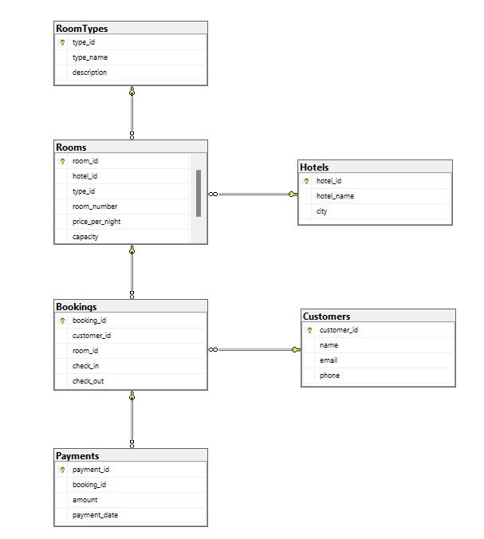

# Hotel Booking Database (SQL Project)

This project implements a relational database for managing hotel bookings, customers, rooms, payments, and hotel revenue.

## Features

- **Customers**, **Hotels**, **RoomTypes**, **Rooms**, **Bookings**, **Payments** tables  
- Relationships enforced with **foreign keys** and constraints  
- **Views**: `BookingDetails` for an easy overview of bookings  
- **Stored Procedure**: `CreateBooking` to handle room reservations with conflict checks  
- **User-defined Function**: `CalculateBookingCost` to calculate total cost of a booking  
- Analytical queries:  
  - Available rooms in a hotel  
  - Number of rooms per hotel  
  - Most expensive room per hotel  
  - Hotel revenue  
  - Top clients based on bookings  

## Technologies

- SQL  
- Microsoft SQL Server

 ## Database Diagram
 
